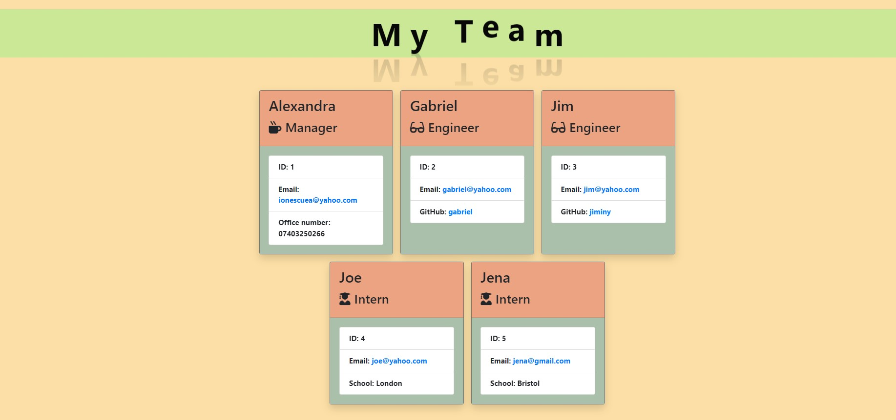

# Team-Profile-Generator

A webpage that displays team's basic info.

## Description

This application will take in information about employees on a software engineering team, then generates an HTML webpage that displays summaries for each person.

## Instalation

The code can be accessed [here](https://github.com/ionescuea/Team-Profile-Generator/blob/main/starter/output/team.html).

## Usage

The application will be invoked by using the following command:

'bash'
'node index.js'
Then, the user should complete the prompts in the terminal whit the necessary info in order to generate the HTML file with the team's info.

The end result will be similar to the below image:

## Credits

[BootcampSpot](https://github.com/edx)

[Alexandra Ionescu](https://github.com/ionescuea)

## License

Licensed under the [MIT](LICENSE) license.
